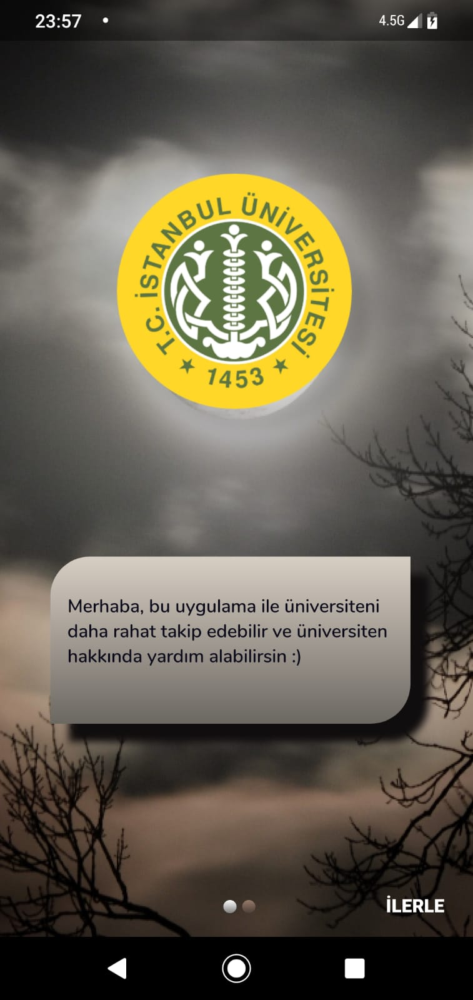
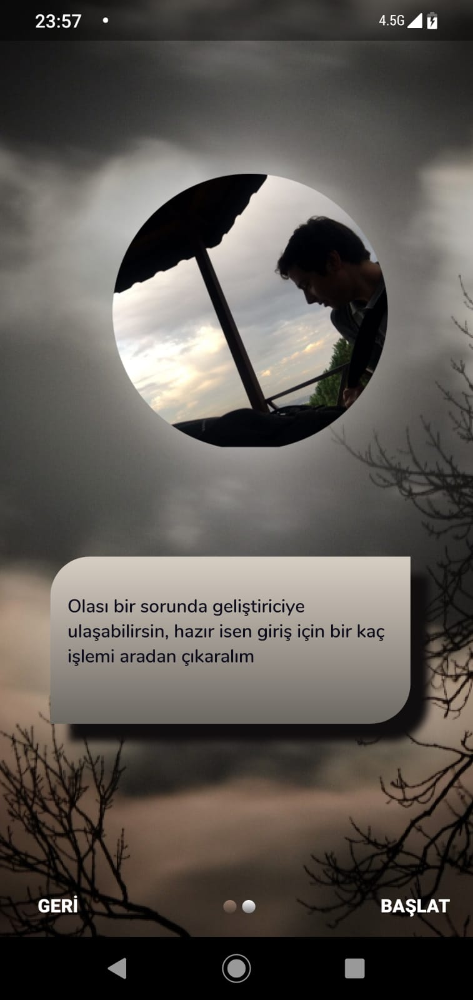
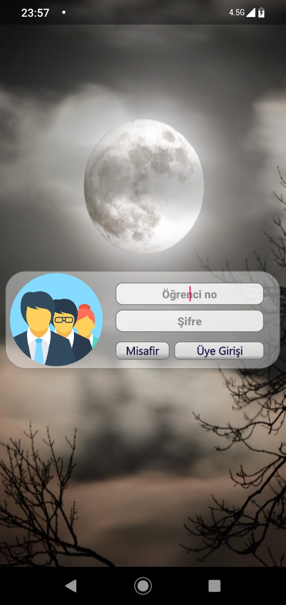
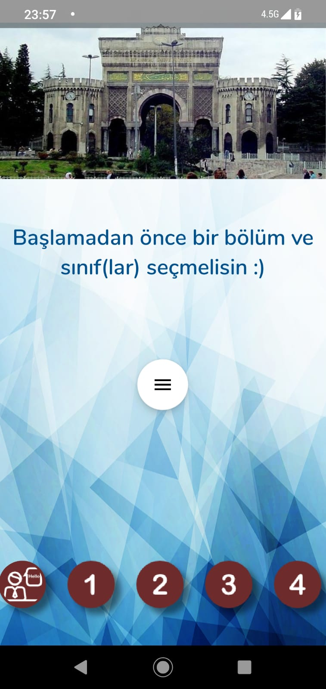
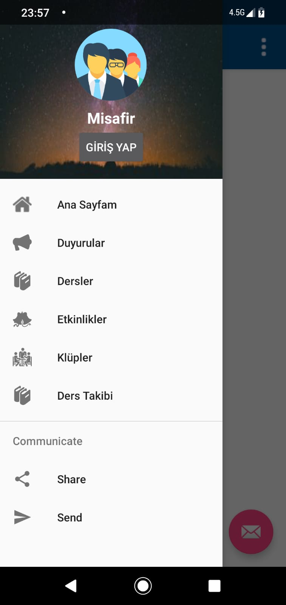
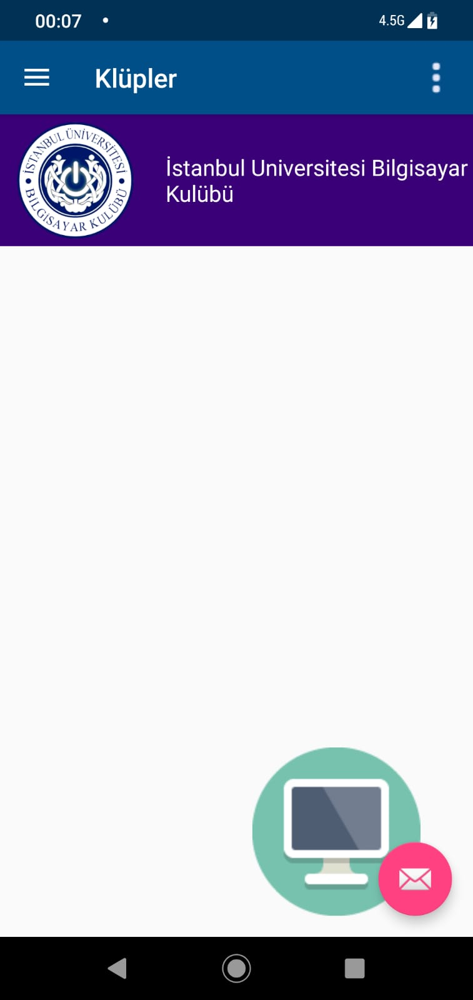
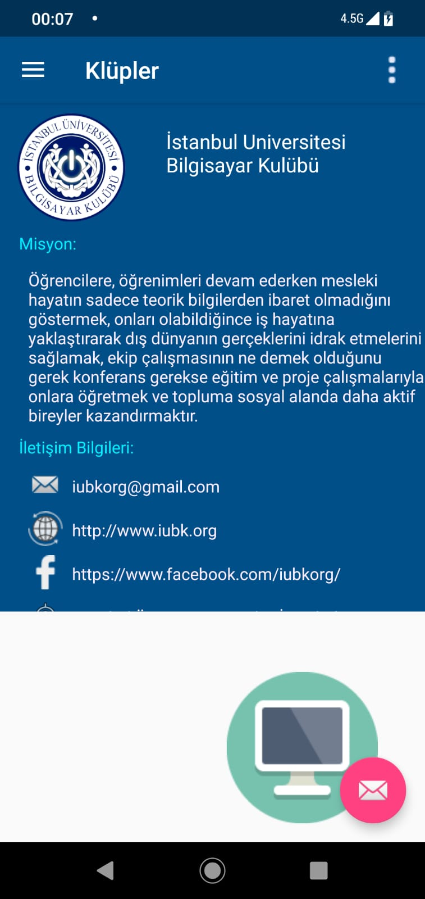

# 🏫 IUApp

İstanbul üniversitesi için mobil uygulama projesi

> Debug sürümünü [buradan](res/iuce_debug.apk) indirebilirsin.

## Uygulamanın Temel Özellikleri

Alttaki tüm alanlar sadece arayüz olarak tasarlanmıştır.

- Öğrenci girişi
- Ders notları
- Okul Klüpleri
- Duyurular
- Etkinlikler

## Uygulamadan Görüntüler

